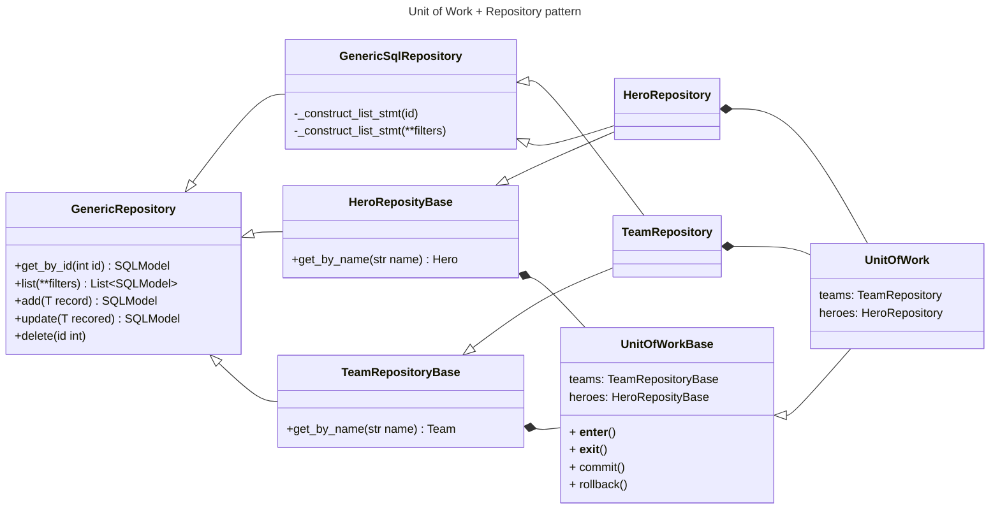

# SQLModel Repository pattern
This repository includes a example implementation of the Unit of Work design and Repository design pattern.


# Getting Started
## Tech-stack
- Python 3.10
- [SQLModel](https://sqlmodel.tiangolo.com/)
  - [Pydantic](https://docs.pydantic.dev/latest/)
  - [SQLAlchemy](https://www.sqlalchemy.org/)

## Setup
### 1. Clone the project:
```bash
git clone https://github.com/manukanne/sqlmodel-repository-pattern.git
```

### 2. Install the requirements:
```bash
python -m pip install -r requirements.txt
```

### 3. Create the .env file:
```
DATABASE_CONNECTION_STR=sqlite://
```
> :information_source: For this project an in-memory SQLite database was used, of course another database supported by [SQLAlchemy](https://docs.sqlalchemy.org/en/20/dialects/) can be used.

# Executing the programm
In order to run the program, simple execute the following command:
```bash
python main.py
```

# Auhors
[Manuel Kanetscheider](https://dev.to/manukanne)

# License
This project is licensed under the MIT permissive license - see the [Licence file](LICENSE) for details.

# Acknowledgments
- [Implementing the Repository and Unit of Work Patterns in an ASP.NET MVC Application](https://learn.microsoft.com/en-us/aspnet/mvc/overview/older-versions/getting-started-with-ef-5-using-mvc-4/implementing-the-repository-and-unit-of-work-patterns-in-an-asp-net-mvc-application)
- [SQLModel](https://sqlmodel.tiangolo.com/)
